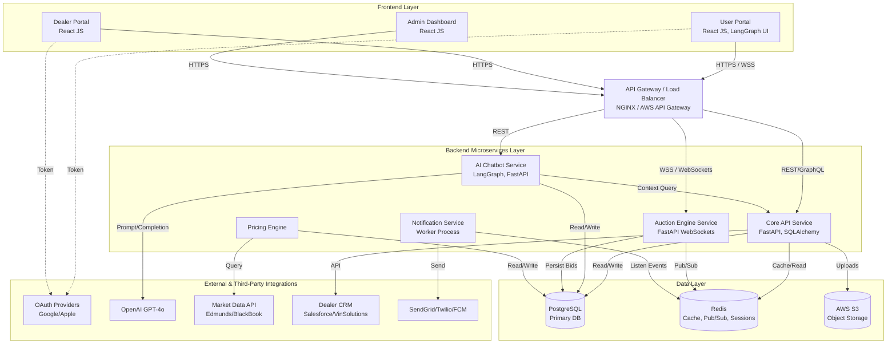

# System Architecture Blueprint

This document outlines the high-level system architecture for the AI Automotive Platform, integrating frontend portals, the API gateway, microservices (including AI and Real-time Engines), and the data layers.

## High-Level Architecture Diagram

## Component Definitions

### 1. Frontend Layer
- **User Portal**: The B2C interface built in React JS where sellers list cars via the AI chatbot (LangGraph UI) and buyers discover cars and manage reverse bidding. Connects to backend via REST and WebSockets.
- **Dealer Portal**: The B2B interface built in React JS for inventory management, CRM integrations, and active bidding dashboards.

### 2. API Gateway
- Routes incoming HTTP requests to the appropriate microservice (Core API vs AI Service).
- Manages WebSocket connection upgrades routing them directly to the Auction Engine.
- Handles rate-limiting, SSL termination, and initial JWT token validation.

### 3. Backend Microservices
- **Core API Service**: Built on FastAPI and SQLAlchemy. Handles CRUD for users, properties, inventory, roles, etc.
- **AI Chatbot Service**: Built on FastAPI, deploying LangGraph orchestrations and serving the LangGraph UI in React JS. Interacts with OpenAI to execute slot-filling.
- **Auction Engine**: Built on FastAPI WebSockets. Maintains persistent WebSocket connections with active users/dealers. Bids are broadcasted to all subscribed clients via Redis Pub/Sub in under 500ms.
- **Notification Service**: Listens for system events (e.g., `bid_placed`, `auction_won`) from Redis and disperses alerts through SendGrid, Twilio, and FCM.
- **Pricing Engine**: Built on FastAPI. Integrates with external market APIs to estimate car values.

### 4. Data Layer
- **PostgreSQL**: Stores relational, highly-structured data (Users, Vehicles, Bids Audit Trail, Transactions).
- **Redis**: Serves as the high-speed state manager for live auctions and the Pub/Sub broker to scale WebSockets across multiple Auction Engine nodes.
- **S3 / Cloud Storage**: Stores un-structured blobs like car photos and inspection pdfs.
