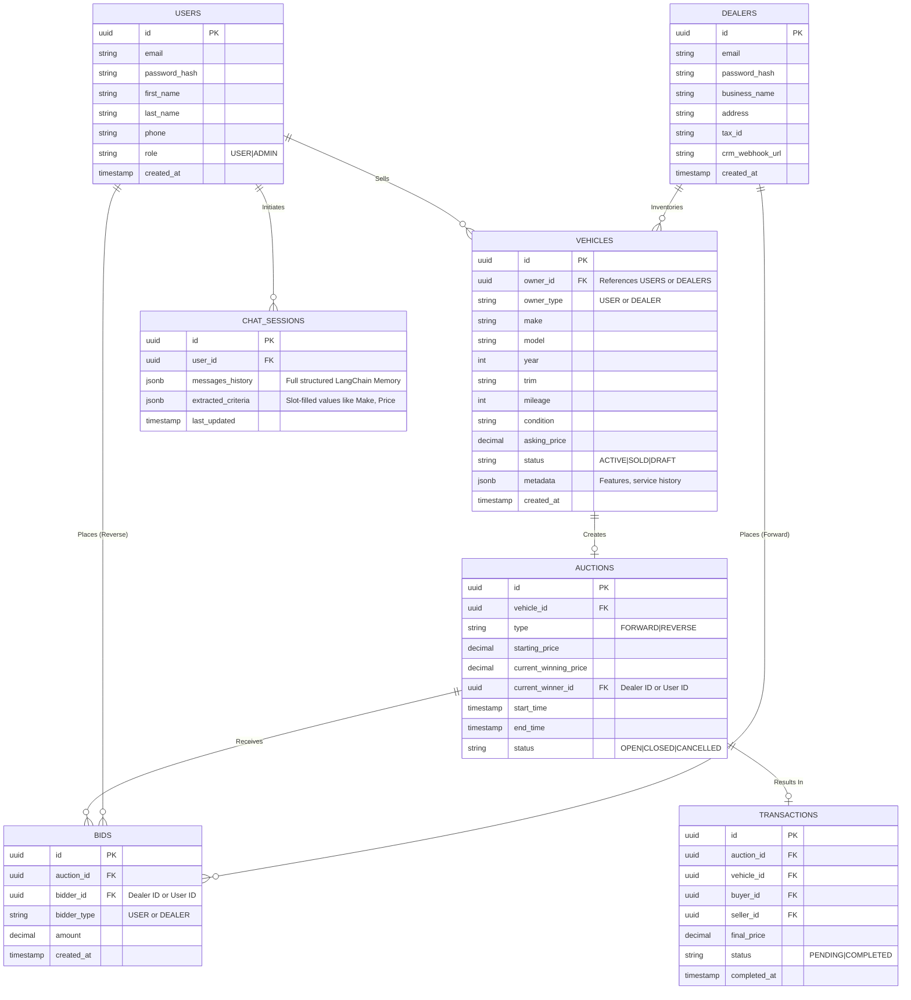

# Entity-Relationship (ER) Diagram

This document outlines the core relations and entities required for the AI Automotive Platform. 
The schema must support Standard E-Commerce workflows, structured Multi-turn Chatbot context mappings, and fast query execution for Auction/Pricing Engines.

## Core Entities
1. **Users (Buyers & Sellers)**
2. **Dealers (B2B Accounts)**
3. **Vehicles (Car Listings)**
4. **Auctions (Forward & Reverse)**
5. **Bids (Auction Bids)**
6. **Transactions (Won Auctions)**
7. **ChatSessions (AI Conversation Context)**

## Mermaid ER Diagram

## Explanation
- A **Vehicle** uses Polymorphic association (`owner_type` and `owner_id`) to belong to either a regular User or a registered Dealer.
- An **Auction** tracks the current state in PostgreSQL. Fast-moving bids will first be tracked in Redis and then asynchronously flushed down to the **Bids** table.
- **ChatSessions** store the conversational history and parsed JSON values (slot-filling data) so that context isn't lost if the user leaves the page or switches devices.
